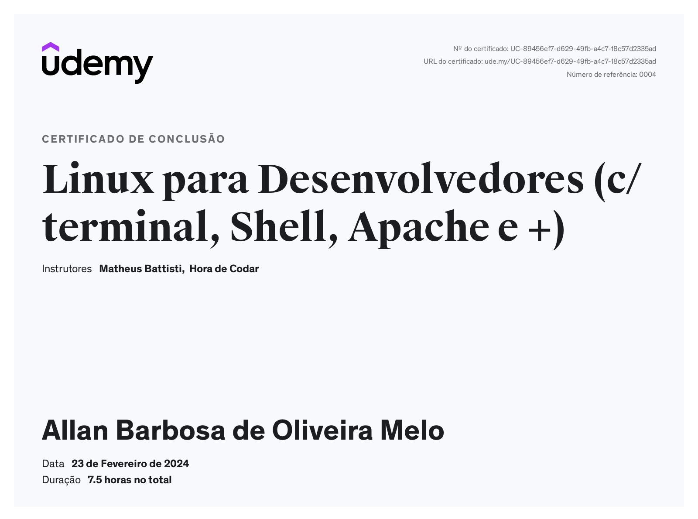

# 🕑Sprint 1
## Introdução 💭
Neste documento, irei exibir e anexar todos o itens referentes a Sprint 1, sendo seus respectivos desafios, um resumo do conteudo visto e tambem os certificados obtidos durante a trilha.

## 📒 Sobre a trilha 
A seguir, eu preparei um resumo sobre o que aprendi nos cursos propostos na trilha de aprendizado. com o objetivo tanto de fixar os conteudos à mente, quanto ter por escrito o que aprendi.

1. [Linux para Desenvolvedores](trilha/linux/README.md)

## 📝 Exercícios 

1. ...

## 🖼️ Evidências 

1. ...

## 📄 Certificados 

- Certificado do Curso Linux para Desenvolvedores

