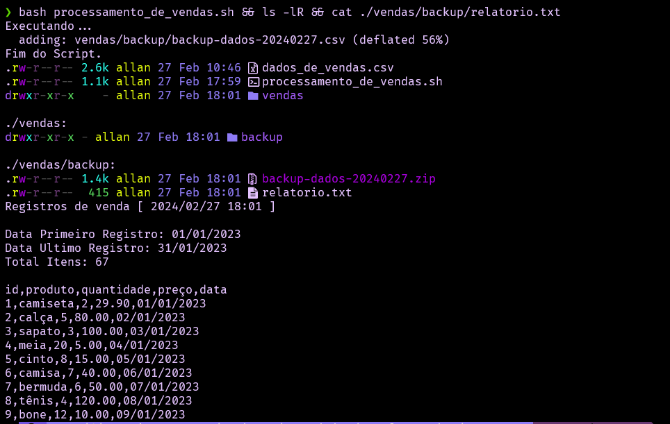

[<- Voltar](https://github.com/AllanBOMelo/Estagio-Compasso)
# 🕑Sprint 1 

## Introdução 💭
Neste documento, irei exibir e anexar todos o itens referentes a Sprint 1, sendo seus respectivos desafios, um resumo do conteudo visto e tambem os certificados obtidos durante a trilha.

## 📒 Sobre a trilha 
A seguir, eu preparei um resumo sobre o que aprendi nos cursos propostos na trilha de aprendizado. com o objetivo tanto de fixar os conteudos à mente, quanto ter por escrito o que aprendi.

1. [Linux para Desenvolvedores](trilha/linux/README.md)

## 📝 Exercícios 

1. [Projeto Linux](./exercicios/ProjetoLAMP/README.md)
2. [Desafio Sprint 1]()


## 🚩 Desafio da Sprint com Evidências 

Nesta sessão, irei tratar do desafio proposto ao fim da sprint, que consiste em um script para tratar dados de vendas.
<!--- Colocar aqui a atividade no udemy --->

#### 1. Preparando arquivos
De inicio, criei as pastas e copiei os arquivos exigidos. 


Após isso, criei o arquivo "processamento_de_vendas.sh", e atribui a ele um comando simples do inicio do desafio, para verificar se tudo iria funcionar. Para isso, apliquei o seguinte código:

Código:
```bash
mkdir vendas
```

Retorno:


Como é possível notar, a pastas 'vendas' foi criada, logo o script funciona. Contudo, se novamente o script for executado, irá retornar o erro "mkdir: cannot create directory ‘vendas’: File exists". Para resolver isso, é viavel usar o parametro **-p** do comando **mkdir**, fazendo com que ele somente crie a pasta, caso ela não exista, ficando da seguinte forma:

Código:
```bash
mkdir -p vendas
```

Retorno:


Dessa forma, a pasta é criada e quando o script é executado novamente, não ocorrem erros, como é possivel notar acima.
Em seguida, é pedido para copiar arquivo dados_dE_vendas.csv para diretorio vendas, então adicionei o comando para copiar o arquivo de dados, e o código ficou da seguinte maneira:

Código:
```bash
mkdir -p vendas
cp ./dados_de_vendas.csv vendas
```

Retorno:


E por fim, pede para que o arquivo de dados seja copiado para dentro de vendas contendo a data de execução, assim, usando do comando **date +%Y%m%d** que retorna a data atual, apliquei ao comando **cp**, ficando da seguinte forma:

Código:
```bash
echo Executando...

mkdir -p vendas
cp ./dados_de_vendas.csv vendas/"dados-$(date +%Y%m%d).csv"

echo Fim do Script.
```

Retorno:


> [!NOTE]
> Adicionei tambem dois comandos echo para visualizar melhor no terminal o inicio e fim da execução do script.

#### Função Backup

Para realizar a função de backup, foram dados os seguintes requisitos de tarefas:
1. Criar subdiretorio 'backup' em 'vendas'
2. Copiar os dados de vendas para dentro dele com o prefixo "backup"

Para isso, notei que é possível modificar o comando responsabel por criar a pasta de venda, de forma que crie tambem a pasta de backup, da seguinte maneira:

Código:
```bash
echo Executando...

mkdir -p vendas/backup
cp ./dados_de_vendas.csv vendas/"dados-$(date +%Y%m%d).csv"

echo Fim do Script.
```

Retorno:


Em seguida, executei outro comando de copiar o arquivo, agora para dentro da pasta backup, usando o prefixo pedido.

Código:
```bash
echo Executando...

mkdir -p vendas/backup
cp ./dados_de_vendas.csv vendas/"dados-$(date +%Y%m%d).csv"
cp ./dados_de_vendas.csv vendas/backup/"backup-dados-$(date +%Y%m%d).csv"

echo Fim do Script.
```

Retorno:


#### Gerar relatorio

Para o relatorio, foram fornecidos os seguintes requisitos:
1. O arquivo deve conter a data atual do sistema em formato  YYYY/MM/DD HH:MI
2. Data do primeiro registro de venda contido no arquivo
3. Data do ultimo registro de venda contido no arquivo
4. A quantidade total de itens diferentes vendidos
5. Exibir as primeiras 10 linhas do arquivo de backup

De inicio, inclui no script um comando parar criar (caso o arquivo não exista) um arquivo relatorio.txt, e ao mesmo tempo incluir a data atual do sistema, ficando da seguinte forma:

Código:
```bash
echo Executando...

mkdir -p vendas/backup
cp ./dados_de_vendas.csv vendas/"dados-$(date +%Y%m%d).csv"
cp ./dados_de_vendas.csv vendas/backup/"backup-dados-$(date +%Y%m%d).csv"

echo Relatorio de vendas [ $(date +%Y/%m/%d\ %H:%M) ] >> relatorio.txt

echo Fim do Script.
```

Retorno:


Como podemos ver na imagem acima, o relatorio foi criado, e nele já contem a data do sistem, porém ele deve ficar dentro do diretorio de backup. Para solucionar isso, adiciono o caminho do arquivo ao "relatorio.txt", e obtenho esse codigo:

Código:
```bash
echo Executando...

mkdir -p vendas/backup
cp ./dados_de_vendas.csv vendas/"dados-$(date +%Y%m%d).csv"
cp ./dados_de_vendas.csv vendas/backup/"backup-dados-$(date +%Y%m%d).csv"

echo Relatorio de vendas [ $(date +%Y/%m/%d\ %H:%M) ] >> ./vendas/backup/relatorio.txt

echo Fim do Script.
```

Retorno:


Com isso resolvido, vou para o proximo passo, que é:

2. Data do primeiro registro de venda contido no arquivo
3. Data do ultimo registro de venda contido no arquivo

Para isso, primeiro tentei adicionar o comando head ao script para obter o primeiro registro do arquivo, porém o arquivo começa com:

```txt
id,produto,quantidade,preço,data
```

E como o primeiro registro está na verdade na linha 2, o comando head não iria servir de forma eficiente, pois ele traria junto a primeira linha. Para resolver essa questão, eu encontrei o comando **sed**, que torna possivel exibir uma linha especifica de um documento da seguinte forma: 

Comando:
```bash
sed -n '2p' ./dados_de_vendas.csv
```

Retorno:


Dessa forma, ele retorna apenas o primeiro registro do documento. Contudo, ainda é necessario somente a data do registro. Para isso, será necessário o comando **cut**, que possui a capacidade de separar uma linha através de um denominador e exibir apesar um dos resultados. Como o denominador em comum que separa os elementos e a virgula, e a dessa forma a data é o quinto elemento, posso juntar o comando **cut** ao comando **sed** com o uso do operador "|" e obter o seguinte resultado:

Comando:
```bash
sed -n '2p' ./dados_de_vendas.csv | cut -d "," -f 5
```

Retorno:


Obtendo assim, apenas a data do registro. Passando esse comando para o script, e usando o operador >> para adicionar o resultado no arquivo de relatorio é concluida a questão da data do primeiro Registro. Para o ultimo registro, foi possivel usar o comando **tail** para obter a ultima linha do registro, e usando o mesmo comando **cut** recebo a data do registro. Adicionando ao script, temos o seguinte código:

Código:
```bash
echo Executando...

mkdir -p vendas/backup
cp ./dados_de_vendas.csv vendas/"dados-$(date +%Y%m%d).csv"
cp ./dados_de_vendas.csv vendas/backup/"backup-dados-$(date +%Y%m%d).csv"

echo Registros de venda [ $(date +%Y/%m/%d\ %H:%M) ] >> ./vendas/backup/relatorio.txt
sed -n '2p' ./dados_de_vendas.csv | cut -d "," -f 5) >> ./vendas/backup/relatorio.txt 
tail -n 1 ./dados_de_vendas.csv | cut -d "," -f 5) >> ./vendas/backup/relatorio.txt

echo Fim do Script.
```

Retorno:


Para melhor entendimento dos dados, irei juntar os comando **sed** e **tail** a um comando **echo**, e até agora este é o script:


Agora, o proximo ponto é a quantidade de itens diferentes vendidos. Para isso, irei usar o comando **wc**, capas de contar bytes, linhas, caracters e etc, para fazer uma contagem de registros no arquivo com o valor-1 para eliminar a primeira linha que contem informações, da seguinte forma:

Código:
```bash
echo Executando...

mkdir -p vendas/backup
cp ./dados_de_vendas.csv vendas/"dados-$(date +%Y%m%d).csv"
cp ./dados_de_vendas.csv vendas/backup/"backup-dados-$(date +%Y%m%d).csv"

echo Registros de venda [ $(date +%Y/%m/%d\ %H:%M) ] >> ./vendas/backup/relatorio.txt
echo Data Primeiro Registro: $(sed -n '2p' ./dados_de_vendas.csv | cut -d "," -f 5) >> ./vendas/backup/relatorio.txt 
echo Data Ultimo Registro: $(tail -n 1 ./dados_de_vendas.csv | cut -d "," -f 5) >> ./vendas/backup/relatorio.txt

echo "Total Itens: $(($(wc -l < dados_de_vendas.csv)-1))"

echo Fim do Script.
```

Retorno:


Assim, o comando é executado junto ao echo para melhor leitura, e recebe como entrada o arquivo de dados, em seguida o resultado é subtraido com -1, gerando a resposta exibida. Por fim, acrescento o parametro para adicionar o resultado ao relatorio, e o código fica da seguinte forma:

Código:
```bash
echo Executando...

mkdir -p vendas/backup
cp ./dados_de_vendas.csv vendas/"dados-$(date +%Y%m%d).csv"
cp ./dados_de_vendas.csv vendas/backup/"backup-dados-$(date +%Y%m%d).csv"

echo Registros de venda [ $(date +%Y/%m/%d\ %H:%M) ] >> ./vendas/backup/relatorio.txt
echo Data Primeiro Registro: $(sed -n '2p' ./dados_de_vendas.csv | cut -d "," -f 5) >> ./vendas/backup/relatorio.txt 
echo Data Ultimo Registro: $(tail -n 1 ./dados_de_vendas.csv | cut -d "," -f 5) >> ./vendas/backup/relatorio.txt

echo "Total Itens: $(($(wc -l < dados_de_vendas.csv)-1))" >> ./vendas/backup/relatorio.txt 

echo Fim do Script.
```

Retorno:


E por fim, para exibir as primeiras 10 linhas do arquivo de backup, será feito uso do comando **head** da seguinte forma:

Código:
```bash
echo Executando...

mkdir -p vendas/backup
cp ./dados_de_vendas.csv vendas/"dados-$(date +%Y%m%d).csv"
cp ./dados_de_vendas.csv vendas/backup/"backup-dados-$(date +%Y%m%d).csv"

echo Registros de venda [ $(date +%Y/%m/%d\ %H:%M) ] >> ./vendas/backup/relatorio.txt
echo Data Primeiro Registro: $(sed -n '2p' ./dados_de_vendas.csv | cut -d "," -f 5) >> ./vendas/backup/relatorio.txt 
echo Data Ultimo Registro: $(tail -n 1 ./dados_de_vendas.csv | cut -d "," -f 5) >> ./vendas/backup/relatorio.txt

echo "Total Itens: $(($(wc -l < dados_de_vendas.csv)-1))" >> ./vendas/backup/relatorio.txt 

head -n 10 ./vendas/backup/"backup-dados-$(date +%Y%m%d).csv" >> ./vendas/backup/relatorio.txt

echo Fim do Script.
```

Retorno:


#### Compactar arquivo

Neste ponto, os requisitos de funcionamento são:
1. Comprimir o arquivo de backup de dados em zip
2. Apagar o arquivo de dados e o arquivo de backup

Para comprimir o arquivo de backup, irei usar o comando **zip**, e para apagar os arquivos pedidos, o comando **rm**, ficando assim com o seguinte código:


Retorno:



## 📄 Certificados 


- Certificado do Curso Linux para Desenvolvedores


