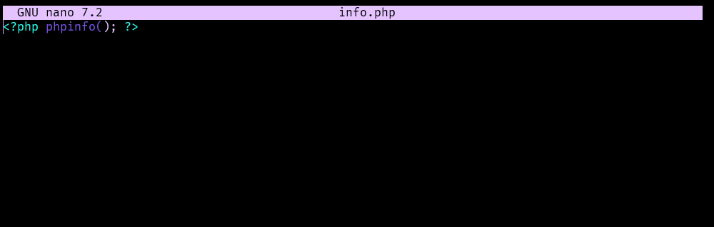
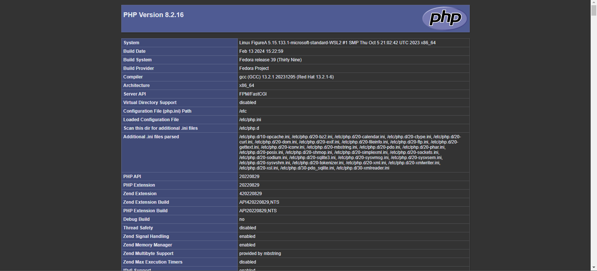
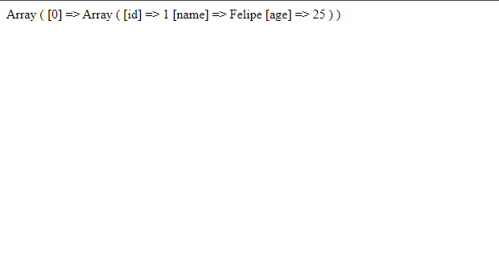

[<- Voltar](../../README.md)
# Projeto 📝

### Projeto LAMP 💡
Este projeto é referente ao final do curso de Linux Para Desenvolvedores, e consiste em uma aplicação simples PhP com Apache rodando em um sistema Linux.

### Instalando Apache:

Sobre a instalação do Apache, eu enfrentei alguns empecilhos, pois na instalação, o pacote retornava como não existente.


Então, após uma pesquisa, descobri na documentação do Fedora, que o pacote se chamava: *httpd*, então só executei o comando:

```console
$~ sudo dnf install httpd -y
```

### Iniciando servidor

Para iniciar o servidor Apache, pude usar o seguinte comando:

```console
$~ sudo systemctl start httpd.service
```

Outros comando que achei úteis foram:

```console
$~ sudo systemctl start httpd
$~ sudo systemctl stop httpd
$~ sudo systemctl restart httpd
$~ sudo systemctl status httpd
```

### Instalando php
Para instalar o php e seus pacotes que foram necessarios na aplicação, usei o comando:

```console
$~ sudo dnf install php-cli php-mbstring php-pear php-mysqli
```

### Iniciando com Apache:
No sistema Linux, no meu caso sendo a distribuição **Fedora**, o diretorio que irá se localizar os arquivos do servidor apache, será em:
/var/www/index
Tendo como arquivo principal 'index.html' que será exibido em [http://localhost](http://localhost).

Dando inicio ao desenvolvimento, comecei com uma página simples em php para verificar suas informações, e se ele está sendo executado:



A seguir, ao entrar na página  'http://localhost/info.php', caimos na pagina:



E com isso, confirmamos que o php está sendo executado. A seguir, seguindo as instruções do curso, criei um script para acessar o banco de dados Mysql, seguindo o modelo:

💻 [app.php](./html/app/app.php)
```php
<?php

    $host     = "localhost";
    $user     = "Allan";
    $password = "Allan-01";
    $db       = "testephp";

    $conn = mysqli_connect($host, $user, $password, $db);

    $sql = "SELECT * FROM users";
    $result = mysqli_query($conn, $sql);
    $users = mysqli_fetch_all($result, MYSQLI_ASSOC);

    print_r($users);

    mysqli_close($conn);
?>
```

Assim, ao acessar a página 'http://localhost/app/app.php', recebi uma página de erro, pois havia colocado o nome do banco como "testePhp" e ele não foi encontrado. Após resolver, pude ver a seguinte página:



Indicando que o script havia funcionado. Após isso, tudo se encerrou ao criar um arquivo index.php para representar a página com o seguinte codigo:

💻 [index.php](./html/app/index.php)
```php
<?php
 include_once "app.php";
?>

<!DOCTYPE html>
<html>
<head>
    <title>Welcome</title>
</head>
<body>
    <h1>Usuarios:</h1>

    <ul>
        <?php foreach($users as $user): ?>
            <li>Nome:
                <?php echo $user['name']; ?>,
                Idade:
                <?php echo $user['age']; ?>
            </li>
        <?php endforeach; ?>
</body>
</html>

```
Que ao acessar a página 'http://localhost/app' pude ver:
