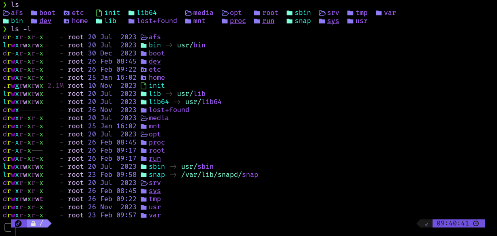
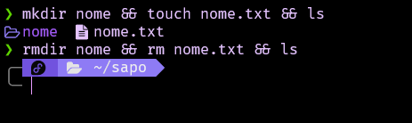
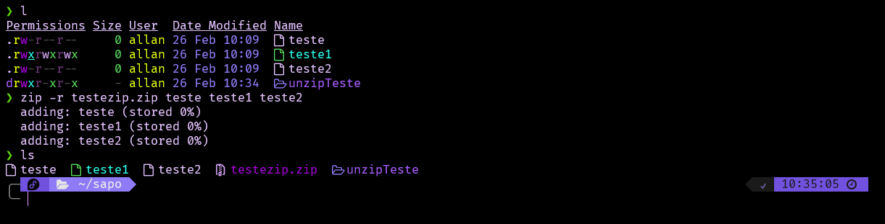
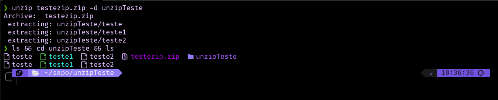
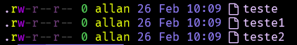
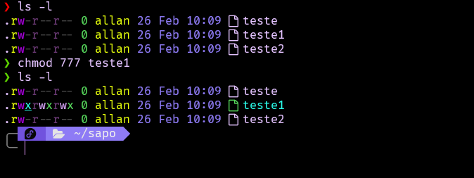

[<- Voltar](../../README.md)
# Resumo da trilha 📊

Aqui, veremos um resumo de tudo mais detalhado sobre o conteúdo que aprendi durante a Sprint 1.

### Linux para Desenvolvedores ✅

#### ⚙️ Instalação:
Como sistema operacional para usar durante o curso, eu optei pelo WSL da distribuição **Fedora**, por questões operacionais, ja que com a distribuição **Ubuntu** eu tive problemas com a instalação de varios pacotes, e até mesmo com o desempenho da mesma.


#### 🧑‍💼 Gerenciamento de Pacotes:
Durante o curso, foi ensinado como funciona o gerenciamento de pacotes no linux, como instalar, atualizar e remover pacotes e aplicativos.
Para isso, existem principais comandos passados como por exemplo:

```console
~$ sudo apt-get update
```

Que é utilizado para atualizar pacotes do sistema. Porem, como estou utilizando a distribuição **Fedora**, o comando **apt-get** não existe. 

```console
~$ sudo apt-get update
~$ sudo: apt-get: command not found
~$ 
```

Ao inves disso, ele é substituido pelo comando **dnf** para realizar a mesma função.


E com isso, é possível executar outros comandos para gerir pacotes, como por exemplo:

```console
~$ sudo dnf update      // Para atualizar repositorios
~$ sudo dnf upgrade     // Para atualizar pacotes
~$ sudo dnf install     // Para instalar pacotes
~$ sudo dnf purge       // Para desinstalar pacotes
```

#### 💻 Comandos Essenciais:

Ao longo do curso, também foram apresentados os comandos mais utilizados para navegação e uso da maquina, atraves do terminal, tal como seus parametros. Os comandos foram:

###### 1. Listagem

Para que seja possível visualizar arquivos e diretorios dentro do terminal, existe o comando **ls**. Ele será responsavel pelo papel de nos guiar pelo sistema, exibindo arquivos e diretorios, e com seus parametros ele será capaz de ordenar, ou mostrar mais informações sobre os arquivos, como as permições de usuarios e tamanho do arquivo.



Alguns de seus parametros mais uteis são:
```console
~$ ls -l    //Exibe os arquivos e diretorios detalhadamente
~$ ls -a    //Exibe arquivos ocultos
~$ ls -tr   //Ordena os arquivos por data
~$ ls -h    //Organiza por tamanho de arquivo 
```

###### 2. Navegação
Para navegação entre diretorios e arquivos através do terminal, é utilizado o comando **cd** e em seguida o diretorio desejado.

```console
~$ cd diretorio
```

Para este comando, existem tambem alguns "atalhos" para acessar certos diretorios de maneira mais rápida, como:

```console
~$ cd ~     // Para acessar a Home
~$ cd /     // Para ir até o root
```

###### 3. Manipulação de arquivos
Para manipular arquivos, o terminal nos oferece alguns comandos principais, como:

```console
~$ mkdir nome        // Cria diretorio chamado 'nome'
~$ touch nome.txt    // Cria arquivo .txt chamado 'nome.txt'
~$ rmdir nome        // Remove o diretorio 'nome'
~$ rm nome.txt       // Remove o arquivo 'nome.txt'
```

Que podemos observar funcionando:



Contudo, o comando **rmdir** possui um detalhe de que ele só remove diretorios vazios, e caso seja usado em um diretorio com algum arquivo, teremos o seguinte erro:

```console
~$ rmdir: failed to remove 'diretorio': Directory not empty
```

Para solucionar isso, podemos apagar ou mover arquivo por arquivo dentro do diretorio. Porem, caso seja necessario apagar o diretorio com tudo o que há nele, podemos usar o seguinte comando para apagar o diretorio junto a todos os seus arquivos:

```console
~$ rm -rfv diretorio
```

Outros comando para manipulação, temos:

```console
~$ cp arquivo arquivonovo destino  // Copiar arquivo
~$ cp -r diretorio destino         // Copiar diretorio
~$ mv arquivo destino              // Move arquivo
~$ cat arquivo                     // Visualiza o arquivo
~$ head arquivo                    // Visualiza as primeiras 10 linhas
~$ tail arquivo                    // Visualiza as ultimas 10 linhas
~$ nano arquivo                    // Abre o arquivo no editor
```

Por fim, temos comandos para compactar/descompactar arquivos, sendo eles:

```console
~$ zip -r nome.zip alvo alvo // Compactar zip
~$ unzip alvo -d destino     // Descompactar
```
**Zip**


**Unzip**


###### 4. Permissões
Pelo terminal, podemos gerenciar as permissões dos usuarios para arquivos e diretorios dentro do sistema. Para visualizar as permições em arquivos, podemos utilizar o comando:

```console
~$ ls -l
```



Na imagem acima, podemos observar um padrão " -rw-r--r-- " que segue o padrão " 1 222 333 444 " sendo:
1. Define se é um arquivo ou diretorio
2. Permissões do dono
3. Permissões do grupo
4. Permissões de terceiros

Com isso, cada simbolo/letra demonstra uma regra na permissão, como por exemplo:
* **D**  // Diretorio
* **-**  // Sem permissão/Arquivo
* **W**  // Permissão de escrita
* **R**  // Permissão de leitura
* **X**  // Permissão de execução

Seguindo este principio, para editar as permissões de um arquivo, podemos executar o comando **chmod**, junto as permições de forma numerica, seguindo a seguinte tebela:

- 0 - Sem permissão
- 1 - Executar
- 2 - Escrever
- 3 - Escrever e Executar
- 4 - Ler
- 5 - Ler e Executar
- 6 - Ler e Escrever
- 7 - Ler, Escrever e Executar

O comando segue o seguinte modelo:

```console 
~$ chmod abc arquivo/diretorio
```

Sendo **a** as permissões do Dono, **b** do grupo e **c** de outros. Como exemplo, temos o arquivo "teste1", onde aplicando o comando:
```console 
~$ chmod 777 teste1
```
Todos terão todas as permissões concebidas.


